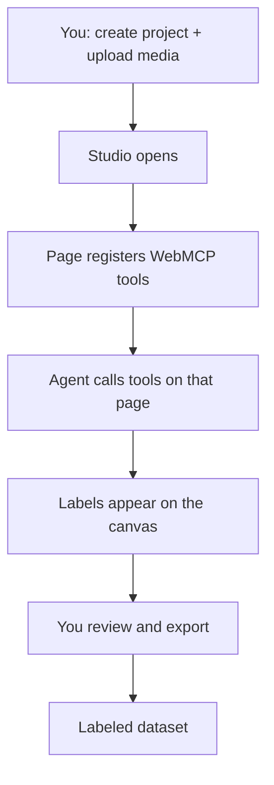
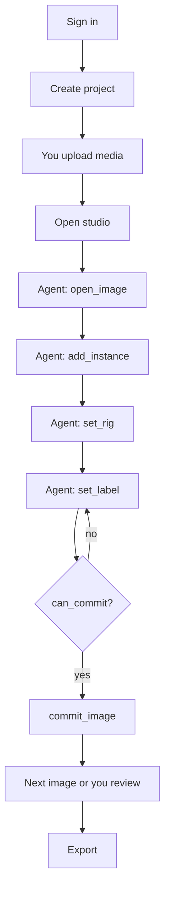

# YADL

*Yet another data labeler*, but in this one, you don't have to click.

**[yadl.vercel.app](https://yadl.vercel.app)** · [github.com/0xABAN/YADL](https://github.com/0xABAN/YADL) · [WebMCP challenge](https://webmcp.devpost.com/)

---

## Why this exists

Computer vision tasks need lots of labeled data. Most data labeling apps make you draw every box by hand. YADL (and WebMCP) lets Codex do it for you while you sleep.

---

## What YADL does

You create a project. Our studio registers WebMCP tools for that project. Codex (or any WebMCP client) calls them to draw geometry, name classes, and commit frames onto the same canvas you see. You review, provide comments, fix stragglers, export. The output is a labeled dataset.




---

## WebMCP tools

YADL registers **15 WebMCP tools** on the open page (`document.modelContext`): project setup, studio navigation, labels, commit, comments, plus a 3-tool geometry pack for the active style (boxes, polygons, or keypoints).

### Example: keypoints

The agent does not free-drag dots. It drives a small FK **rig** (joints in, landmarks out):

| Tool | Does |
| --- | --- |
| `add_instance` | Spawn a hand / pose / face on the image |
| `set_rig` | Move root and joints in one shot |
| `get_rig` | Read back the live rig (and optional landmarks) |

Then the shared tools finish the frame: open image → rig tools → set label → commit. Humans can still free-drag dots and run MediaPipe assist; that path is UI-only.

---

## End to end



---

## Stack

Vercel (Next.js UI + tool registration) → Railway (FastAPI) → Postgres + S3. Browser uses same-origin `/api/*`; large files presign to S3.

```
src/frontend   UI + WebMCP tools
src/backend    API, assist, storage
schema.sql     DB
```

---

## License

[Apache License 2.0](LICENSE)
