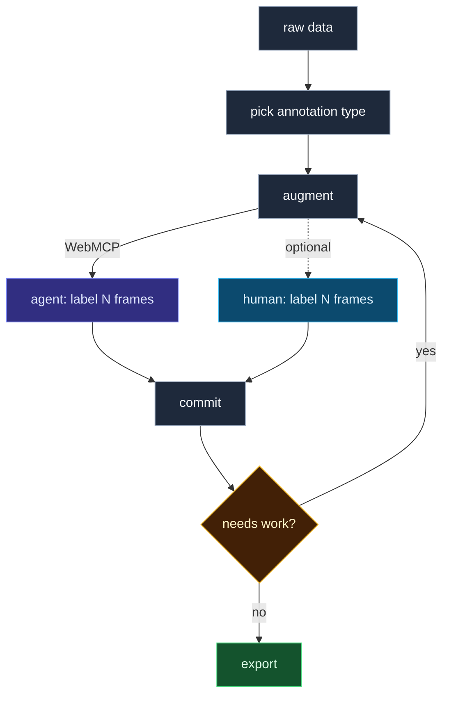

<h1 align="center">YADL</h1>

  

  <em>Yet another data labeler, but in this one, you don't have to click.</em>

## Why YADL

Computer vision tasks need lots of labeled data. Most data labeling apps make you draw every box by hand. YADL (and WebMCP) lets Codex do it for you while you sleep.

First, you create a project. Then, studio registers the WebMCP tools. Codex (or any WebMCP client) calls them to draw geometry, name classes, and commit frames onto the same canvas you see. You review, provide comments, fix stragglers, export. The output is a labeled dataset.

## WebMCP tools

YADL defines **26 unique WebMCP tools** across the app. The create page exposes 3; Studio exposes 17 at once—14 shared tools plus a 3-tool geometry pack for the active style (boxes, polygons, or keypoints).

### Example: keypoints

The agent does not free-drag dots. It drives a small FK **rig** (joints in, landmarks out):

| Tool | Does |
| --- | --- |
| `add_instance` | Spawn a hand / pose / face on the image |
| `set_rig` | Move root and joints in one shot |
| `get_rig` | Read back the live rig (and optional landmarks) |

Then the shared tools finish the frame: open image → rig tools → set label → commit. Humans can still free-drag dots and run MediaPipe assist; that path is UI-only.

## Stack

| Layer | What | Where |
| --- | --- | --- |
| UI + WebMCP | Next.js / TypeScript / React | Vercel (`yadl.vercel.app`) |
| API | FastAPI / Python (auth, projects, assist, export) | Railway |
| Data | Postgres (labels, projects, users) | AWS RDS |
| Media | Image / video bytes | S3 |
| Assist | MediaPipe still-image seed (CPU) | API container |

The browser only talks to the Vercel origin. `/api/*` is rewritten to Railway. Big files never go through that proxy: the API hands back a short-lived S3 PUT URL, the browser uploads straight to the bucket, then the API registers the key.

| Path | Role |
| --- | --- |
| `src/frontend` | Studio UI, WebMCP tool registration |
| `src/backend` | FastAPI routes, MediaPipe assist, S3/DB |
| `schema.sql` | Postgres schema |
| `Dockerfile` | Railway API image |

---

## License

[Apache License 2.0](LICENSE)
